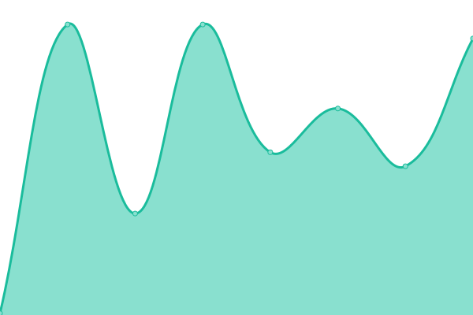
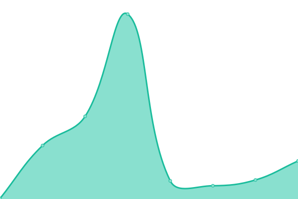
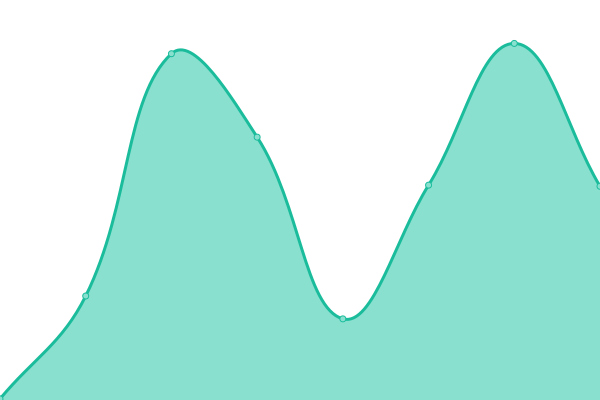
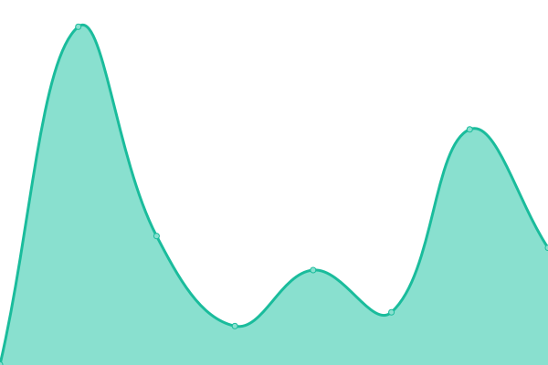
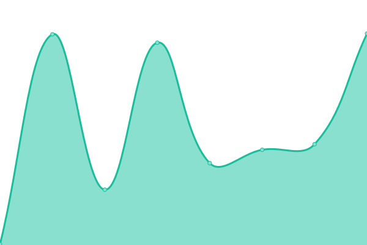
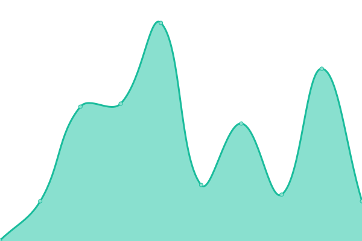

# [📈 Live Status](https://derrick-roach.github.io/us-fed-gov-uptime): <!--live status--> **🟧 Partial outage**

This repository contains the open-source uptime monitor and status page for [several U.S. Federal Government websites](https://derrick-roach.github.io/us-fed-gov-uptime), powered by [Upptime](https://github.com/upptime/upptime).

With [Upptime](https://upptime.js.org), you can get your own unlimited and free uptime monitor and status page, powered entirely by a GitHub repository. We use [Issues](https://github.com/derrick-roach/us-fed-gov-uptime/issues) as incident reports, [Actions](https://github.com/derrick-roach/us-fed-gov-uptime/actions) as uptime monitors, and [Pages](https://derrick-roach.github.io/us-fed-gov-uptime) for the status page.

<!--start: status pages-->
<!-- This summary is generated by Upptime (https://github.com/upptime/upptime) -->
<!-- Do not edit this manually, your changes will be overwritten -->
<!-- prettier-ignore -->
| URL | Status | History | Response Time | Uptime |
| --- | ------ | ------- | ------------- | ------ |
|  [CDC.gov](https://www.cdc.gov) | 🟩 Up | [cdc-gov.yml](https://github.com/derrick-roach/us-fed-gov-uptime/commits/HEAD/history/cdc-gov.yml) | 

 78ms
     
 | 

<a href="https://derrick-roach.github.io/us-fed-gov-uptime/history/cdc-gov">100.00%</a>
    

|  [IRS.gov](https://www.irs.gov) | 🟩 Up | [irs-gov.yml](https://github.com/derrick-roach/us-fed-gov-uptime/commits/HEAD/history/irs-gov.yml) | 

 169ms
     
 | 

<a href="https://derrick-roach.github.io/us-fed-gov-uptime/history/irs-gov">100.00%</a>
    

|  [NIH.gov](https://www.nih.gov) | 🟩 Up | [nih-gov.yml](https://github.com/derrick-roach/us-fed-gov-uptime/commits/HEAD/history/nih-gov.yml) | 

 144ms
     
 | 

<a href="https://derrick-roach.github.io/us-fed-gov-uptime/history/nih-gov">100.00%</a>
    

|  [SSA.gov](https://www.ssa.gov) | 🟥 Down | [ssa-gov.yml](https://github.com/derrick-roach/us-fed-gov-uptime/commits/HEAD/history/ssa-gov.yml) | 

 36ms
     
 | 

<a href="https://derrick-roach.github.io/us-fed-gov-uptime/history/ssa-gov">100.00%</a>
    

|  [USA.gov](https://www.usa.gov) | 🟩 Up | [usa-gov.yml](https://github.com/derrick-roach/us-fed-gov-uptime/commits/HEAD/history/usa-gov.yml) | 

 185ms
     
 | 

<a href="https://derrick-roach.github.io/us-fed-gov-uptime/history/usa-gov">100.00%</a>
    

|  [USPS.com](https://www.usps.com) | 🟩 Up | [usps-com.yml](https://github.com/derrick-roach/us-fed-gov-uptime/commits/HEAD/history/usps-com.yml) | 

 200ms
     
 | 

<a href="https://derrick-roach.github.io/us-fed-gov-uptime/history/usps-com">100.00%</a>
    

|  [Healthcare.gov](https://www.healthcare.gov) | 🟩 Up | [healthcare-gov.yml](https://github.com/derrick-roach/us-fed-gov-uptime/commits/HEAD/history/healthcare-gov.yml) | 

 153ms
     
 | 

<a href="https://derrick-roach.github.io/us-fed-gov-uptime/history/healthcare-gov">100.00%</a>
    

|  [Whitehouse.gov](https://www.whitehouse.gov) | 🟩 Up | [whitehouse-gov.yml](https://github.com/derrick-roach/us-fed-gov-uptime/commits/HEAD/history/whitehouse-gov.yml) | 

 161ms
     
 | 

<a href="https://derrick-roach.github.io/us-fed-gov-uptime/history/whitehouse-gov">100.00%</a>
    

<!--end: status pages-->

[**Visit the status website →**](https://derrick-roach.github.io/us-fed-gov-uptime)

## 📄 License

- Powered by: [Upptime](https://github.com/upptime/upptime)
- Code: [MIT](./LICENSE) © [Anand Chowdhary](https://anandchowdhary.com), supported by [Pabio](https://pabio.com)
- Data in the `./history` directory: [Open Database License](https://opendatacommons.org/licenses/odbl/1-0/)
